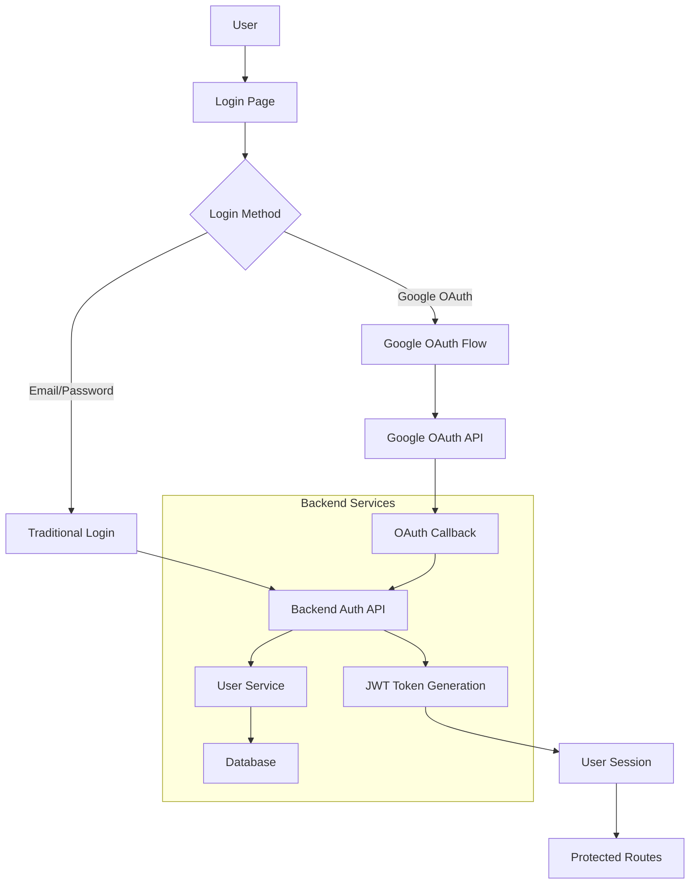

# Design Document: Google OAuth Login Integration

## Overview

This design document outlines the implementation of Google OAuth 2.0 authentication for the ColaStore application. The solution integrates with the existing JWT-based authentication system, allowing users to sign in with their Google accounts while maintaining compatibility with the current user management and session handling.

The implementation uses Passport.js with the Google OAuth 2.0 strategy on the backend and provides a seamless frontend experience that works alongside the existing email/password authentication.

## Architecture

### High-Level Architecture



### Component Architecture

The implementation consists of four main components:

1. **Frontend OAuth Integration**: React components for Google sign-in
2. **Backend OAuth Routes**: Express.js routes handling OAuth flow
3. **Database Schema Updates**: User model extensions for OAuth support
4. **Authentication Middleware**: Integration with existing JWT system

## Components and Interfaces

### Frontend Components

#### GoogleLoginButton Component
```typescript
interface GoogleLoginButtonProps {
  onLoading?: (loading: boolean) => void;
  onError?: (error: string) => void;
  className?: string;
}

const GoogleLoginButton: React.FC<GoogleLoginButtonProps>
```

#### Updated LoginPage Component
The existing login page will be enhanced to include the Google OAuth option while maintaining the current email/password form.

### Backend API Endpoints

#### OAuth Initiation Endpoint
```
GET /api/auth/google
```
- Initiates Google OAuth flow
- Redirects to Google authorization server
- Uses Passport.js GoogleStrategy

#### OAuth Callback Endpoint
```
GET /api/auth/google/callback
```
- Handles Google OAuth callback
- Processes authorization code
- Creates or authenticates user
- Returns JWT token and user data

### Database Schema Extensions

#### User Model Updates
```javascript
// Additional fields for User model
{
  google_id: {
    type: DataTypes.STRING,
    unique: true,
    allowNull: true
  },
  provider: {
    type: DataTypes.ENUM('local', 'google'),
    defaultValue: 'local',
    allowNull: false
  },
  // password_hash becomes nullable for Google-only accounts
  password_hash: {
    type: DataTypes.STRING,
    allowNull: true  // Changed from false to true
  }
}
```

## Data Models

### OAuth User Profile
```typescript
interface GoogleProfile {
  id: string;
  displayName: string;
  emails: Array<{
    value: string;
    verified: boolean;
  }>;
  photos: Array<{
    value: string;
  }>;
}
```

### Enhanced User Model
```typescript
interface User {
  id: number;
  fullname: string;
  email: string;
  password_hash?: string;  // Optional for OAuth users
  phonenumber?: string;
  role_id: number;
  google_id?: string;      // New field
  provider: 'local' | 'google';  // New field
  reset_code?: string;
  reset_code_expires?: Date;
  createdAt: Date;
  updatedAt: Date;
}
```

### Authentication Response
```typescript
interface AuthResponse {
  errCode: number;
  message: string;
  user?: {
    id: number;
    fullname: string;
    email: string;
    role_id: string;
    provider: string;
  };
  token?: string;
}
```

## Correctness Properties

*A property is a characteristic or behavior that should hold true across all valid executions of a system-essentially, a formal statement about what the system should do. Properties serve as the bridge between human-readable specifications and machine-verifiable correctness guarantees.*

Based on the prework analysis, I've identified several redundant properties that can be consolidated:
- Properties about OAuth flow steps (1.1, 1.2, 1.5) can be combined into a comprehensive OAuth flow property
- Properties about user creation and authentication (1.3, 1.4, 2.1, 2.2) can be consolidated into user management properties
- Properties about JWT integration (5.3, 5.4, 5.5) can be combined into a single JWT compatibility property

### Property 1: OAuth Flow Integrity
*For any* user initiating Google OAuth, the complete flow from button click through Google authorization to final authentication should result in a valid JWT token and appropriate redirect
**Validates: Requirements 1.1, 1.2, 1.5**

### Property 2: New User Creation
*For any* Google profile with a new email address, the system should create a new user account with role_id 2, store the Google ID, and set provider to 'google'
**Validates: Requirements 1.3, 2.1, 2.2**

### Property 3: Existing User Authentication
*For any* Google profile with an existing email address, the system should authenticate the user to their existing account and update their Google ID if not already set
**Validates: Requirements 1.4**

### Property 4: Profile Synchronization
*For any* Google user with changed profile information, signing in should update their stored profile data to match the current Google profile
**Validates: Requirements 2.3**

### Property 5: Feature Parity
*For any* Google-authenticated user, they should have access to the same features and permissions as traditionally authenticated users with the same role
**Validates: Requirements 2.4, 2.5**

### Property 6: Security Validation
*For any* OAuth communication, all URLs should use HTTPS protocol and all tokens should be validated before processing
**Validates: Requirements 3.1, 3.2**

### Property 7: Data Minimization
*For any* Google profile processed, only necessary user information (id, email, name) should be stored in the database
**Validates: Requirements 3.3**

### Property 8: Error Handling
*For any* OAuth error condition, the system should return appropriate error messages without exposing sensitive information
**Validates: Requirements 3.5, 4.4**

### Property 9: UI State Management
*For any* OAuth authentication in progress, the interface should display appropriate loading states until completion
**Validates: Requirements 4.3**

### Property 10: JWT Compatibility
*For any* successful Google authentication, the generated JWT token should work with all existing authentication middleware and return the same response format as traditional login
**Validates: Requirements 5.3, 5.4, 5.5**

### Property 11: Database Constraints
*For any* Google user account, the system should allow null password_hash while maintaining data integrity for all other required fields
**Validates: Requirements 6.3**

## Error Handling

### OAuth Error Scenarios

1. **Google Service Unavailable**
   - Display user-friendly message: "Google sign-in is temporarily unavailable"
   - Log detailed error for debugging
   - Provide fallback to email/password login

2. **Invalid OAuth Response**
   - Validate all required fields in Google profile
   - Handle missing email or invalid profile data
   - Redirect to login with error message

3. **Database Connection Issues**
   - Implement retry logic for transient failures
   - Graceful degradation with appropriate error messages
   - Maintain transaction integrity

4. **JWT Generation Failures**
   - Log security-related errors
   - Return generic authentication failure message
   - Ensure no sensitive data in error responses

### Frontend Error Handling

```typescript
interface OAuthError {
  code: string;
  message: string;
  userMessage: string;
}

const handleOAuthError = (error: OAuthError) => {
  // Log for debugging
  console.error('OAuth Error:', error);
  
  // Show user-friendly message
  toast.error(error.userMessage || 'Authentication failed. Please try again.');
  
  // Reset UI state
  setLoading(false);
};
```

## Testing Strategy

### Dual Testing Approach

The implementation will use both unit tests and property-based tests to ensure comprehensive coverage:

**Unit Tests**: Focus on specific examples, edge cases, and integration points
- Test specific OAuth callback scenarios
- Test database migration execution
- Test error handling with specific error conditions
- Test UI component rendering and interactions

**Property-Based Tests**: Verify universal properties across all inputs
- Generate random Google profiles to test user creation/authentication
- Test OAuth flow with various valid/invalid token combinations
- Verify JWT compatibility across different user scenarios
- Test security properties with various input combinations

### Property-Based Testing Configuration

- **Framework**: Use `fast-check` for JavaScript/TypeScript property-based testing
- **Iterations**: Minimum 100 iterations per property test
- **Test Tags**: Each property test must reference its design document property
  - Format: **Feature: google-oauth-login, Property {number}: {property_text}**

### Test Coverage Requirements

1. **OAuth Flow Testing**
   - Mock Google OAuth responses for consistent testing
   - Test both successful and failed authentication scenarios
   - Verify redirect URLs and callback handling

2. **Database Integration Testing**
   - Test user creation with various Google profile combinations
   - Verify existing user authentication and profile updates
   - Test database constraints and migration scripts

3. **JWT Integration Testing**
   - Verify OAuth-generated tokens work with existing middleware
   - Test token validation and expiration handling
   - Ensure response format consistency

4. **Frontend Integration Testing**
   - Test Google sign-in button functionality
   - Verify loading states and error message display
   - Test integration with existing login page components

### Security Testing

- Test with malformed OAuth responses
- Verify token validation prevents unauthorized access
- Test HTTPS enforcement in production environment
- Validate data sanitization and storage practices

<function_calls>
<invoke name="prework">
<parameter name="featureName">google-oauth-login